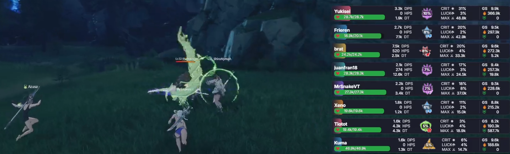
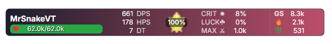
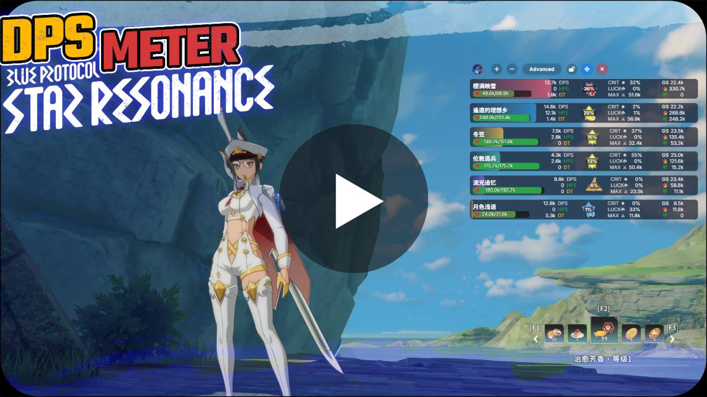
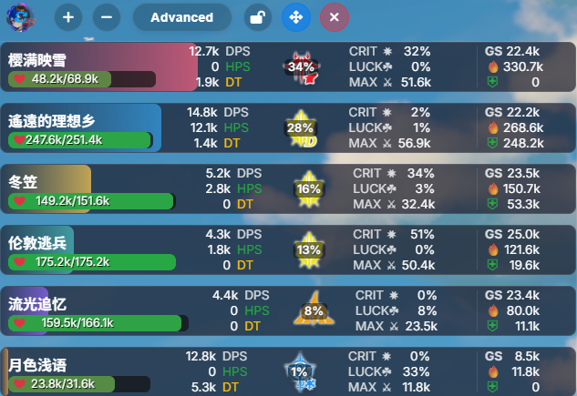
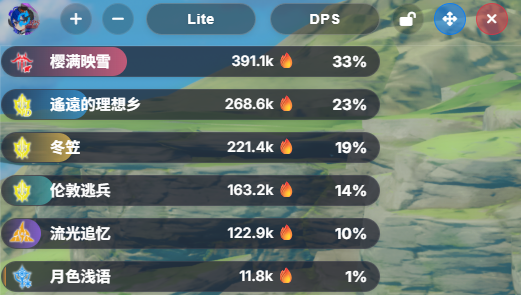
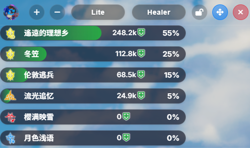

  

# BPSR Meter - Medidor de DPS para Blue Protocol

[![English](https://img.shields.io/badge/English-blue?style=for-the-badge&logo=data:image/svg+xml;base64,PHN2ZyB4bWxucz0iaHR0cDovL3d3dy53My5vcmcvMjAwMC9zdmciIHZpZXdCb3g9IjAgMCA4NDAgNjMwIj48cGF0aCBmaWxsPSIjYjIyMjM0IiBkPSJNMCAwaDk4MHY2ODNIMHoiLz48cGF0aCBmaWxsPSIjZmZmIiBkPSJNMCA3Nmg5ODB2NTJIMHptMCAxNTJoOTgwdi01Mkgwem0wIDE1Mmg5ODB2LTUySDB6bTAgMTUyaDk4MHYtNTJIMHptMCAxNTJoOTgwdi01MkgweiIvPjxwYXRoIGZpbGw9IiMwMDMyOTYiIGQ9Ik0wIDBoNDIwVjM2OEgwem0zMCAyNGwzMyAxMDIgMTAtMzEtMzItODcgNzIgMzcgOTctMzcgMTIgMzItNzIgODYgMTIgMzEgOTYtMzcgNzIgMzYtMzItODcgMTAtMzIgMzMgMTAyLTEwMy02Mi0xMDMgNjIgMzMgMTAyIDEwLTMxLTMyLTg3IDcyIDM3IDk7LTM3IDEyIDMyLTcyIDg2IDEyIDMxIDk2LTM3IDcyIDM2LTMyLTg3IDEwLTMyIDMzIDEwMi0xMDMtNjItMTAzIDYyem0wIDEyMGwzMyAxMDIgMTAtMzEtMzItODcgNzIgMzcgOTctMzcgMTIgMzItNzIgODYgMTIgMzEgOTYtMzcgNzIgMzYtMzItODcgMTAtMzIgMzMgMTAyLTEwMy02Mi0xMTAgNjIgMzMgMTAyIDEwLTMxLTMyLTg3IDcyIDM3IDk3LTM3IDEyIDMyLTcyIDg2IDEyIDMxIDk2LTM3IDcyIDM2LTMyLTg3IDEwLTMyIDMzIDEwMi0xMDMtNjItMTAzIDYyem0xNjggMTIwbDMzIDEwMiAxMC0zMS0zMi04NyA3MiAzNyA5Ny0zNyAxMiAzMi03MiA4NiAxMiAzMSA5Ni0zNyA3MiAzNi0zMi04NyAxMC0zMiAzMyAxMDItMTAzLTYyLTEwMyA2MnoiLz48L3N2Zz4=)](#bpsr-meter-english-version)

---

# BPSR Meter

BPSR Meter es una aplicación de escritorio que funciona como un medidor de DPS (Daño Por Segundo) en tiempo real para el juego. Se superpone a la ventana del juego para proporcionar estadísticas de combate detalladas sin interrumpir la jugabilidad.

## Características

1.  **Nombre de jugador:** Tu identificador en el medidor.
2.  **Vida actual y máxima:** Barra de salud visual.
3.  **DPS (Daño por Segundo):** Daño infligido por segundo.
4.  **HPS (Curación por Segundo):** Curación realizada por segundo.
5.  **DT (Daño Recibido):** Daño total recibido durante el combate.
6.  **Contribución %:** Tu porcentaje del daño total del grupo.
7.  **CRIT ✸:** Porcentaje de golpes críticos.
8.  **LUCK ☘:** Porcentaje de golpes de suerte.
9.  **MAX ⚔ (Máximo DPS):** Tu pico más alto de daño por segundo.
10. **GS (Puntuación de Equipo):** Puntuación de tu equipamiento y habilidades.
11. **🔥 (Daño Total):** Daño total acumulado en el encuentro.
12. **⛨ (Curación Total):** Curación total acumulada en el encuentro.

---
> ### Uso Responsable
> Esta herramienta está diseñada para ayudarte a mejorar tu propio rendimiento. **Por favor, no la utilices para degradar, acosar o discriminar a otros jugadores.** El objetivo es la superación personal y el disfrute del juego en comunidad.

## Instalación

1.  **Descargar el instalador:** Ve a la sección de "Releases" de este repositorio de GitHub y descarga la última versión del instalador (`BPSR Meter Setup X.X.X.exe`).
2.  **Ejecutar el instalador:** Ejecuta el archivo `.exe` descargado y sigue las instrucciones para instalar la aplicación en tu computadora.
3.  **Instalar Npcap:** La aplicación requiere Npcap para capturar el tráfico de red del juego. Si no lo tienes instalado, ve a la sección de "Releases" de este repositorio de GitHub y descarga la última versión del instalador (`npcap-1.83.exe`).

---

## Instrucciones de Uso

### Video Tutorial
Para una guía visual sobre cómo instalar y configurar el medidor, puedes ver el siguiente video:

---

## Uso

Una vez instalada, puedes iniciar la aplicación desde el menú de inicio o el acceso directo del escritorio.

La aplicación se abrirá como una ventana superpuesta. Cuando inicies el juego, comenzará a detectar automáticamente el tráfico y a mostrar las estadísticas de combate.

### Controles

|  |  |  |
| :---: |:---:| :---:|

- **Arrastrar:** Haz clic y arrastra el indicador de flechas para mover la ventana.
- **Bloquear/Desbloquear:** Haz clic en el botón del candado para bloquear o desbloquear la posición de la ventana. Cuando está bloqueada, la ventana ignorará los clics del ratón.
- **Zoom:** Utiliza los botones `+` y `-` para aumentar o disminuir el tamaño de la interfaz.
- **Cerrar:** Haz clic en el botón `X` para cerrar la aplicación.

## Solución de problemas

Si la aplicación no funciona correctamente, revisa el archivo de log `iniciar_log.txt` que se encuentra en el directorio de datos de la aplicación. Para encontrar este directorio, puedes buscar `%APPDATA%/bpsr-meter` en Windows. Puedes enviarme los errores a Discord o ponerte en contacto conmigo e intentaré resolverlo.

## Preguntas Frecuentes (FAQ)

**¿Es baneable usar este medidor?**
> Opera en una "zona gris". No modifica archivos, no inyecta código ni altera la memoria del juego. Históricamente, las herramientas que solo leen datos tienen un riesgo de baneo extremadamente bajo. Sin embargo, **úsalo bajo tu propia responsabilidad.**

**¿Afecta el rendimiento de mi juego (FPS)?**
> No. El impacto es prácticamente nulo, ya que la captura de paquetes es un proceso pasivo y muy ligero.

**¿Por qué necesita ejecutarse como administrador?**
> Para que la librería Npcap pueda acceder a bajo nivel a los adaptadores de red y monitorear los paquetes del juego.

**El medidor no muestra datos, ¿qué hago?**
> 1. Asegúrate de que el juego esté corriendo **antes** de iniciar el medidor.
> 2. Confirma que ejecutaste el medidor **como administrador**.
> 3. Revisa que tu firewall o antivirus no lo esté bloqueando.
> 4. Si tienes múltiples conexiones de red (Ethernet, Wi-Fi, VPN), el medidor podría estar escuchando en la incorrecta.

**¿El medidor se puede ocultar?**
> Sí, puedes ocultarlo haciendo clic en el icono de la barra de tareas.

**¿Se pueden ocultar más datos?**
> Sí, ahora existen los botones "Advanced" y "Lite", que te permiten cambiar entre la versión extendida y la simplificada.

**¿Funciona con otros juegos?**
> No. Está diseñado específicamente para decodificar los paquetes de red de este juego.

**¿Funciona en el servidor chino?**
> Sí, funciona correctamente en el servidor chino.

**¿Hay versión para healer?**
> Sí, al estar en modo "Lite", aparecerá a un lado un botón que permite cambiar entre la versión de DPS y la de Healer. Ahora puedes optimizar tus rotaciones y ver tu sanación por segundo (HPS) y tu contribución total.

---

## Redes Sociales

---
---

# BPSR Meter (English Version)

BPSR Meter is a desktop application that acts as a real-time DPS (Damage Per Second) meter for the game. It overlays the game window to provide detailed combat statistics without interrupting your gameplay.

## Features

1.  **Player Name:** Your identifier in the meter.
2.  **Current/Max Health:** A visual health bar.
3.  **DPS (Damage Per Second):** Damage dealt per second.
4.  **HPS (Healing Per Second):** Healing done per second.
5.  **DT (Damage Taken):** Total damage received during combat.
6.  **Contribution %:** Your percentage of the group's total damage.
7.  **CRIT ✸:** Your critical hit rate percentage.
8.  **LUCK ☘:** Your lucky hit rate percentage.
9.  **MAX ⚔ (Max DPS):** Your highest damage-per-second peak.
10. **GS (Gear Score):** A score based on your equipment and skills.
11. **🔥 (Total Damage):** Total accumulated damage in the encounter.
12. **⛨ (Total Healing):** Total accumulated healing in the encounter.

---
> ### Responsible Use
> This tool is designed to help you improve your own performance. **Please do not use it to degrade, harass, or discriminate against other players.** The goal is self-improvement and enjoying the game as a community.

## Installation

1.  **Download the installer:** Go to the "Releases" section of this GitHub repository and download the latest version of the installer (`BPSR Meter Setup X.X.X.exe`).
2.  **Run the installer:** Execute the downloaded `.exe` file and follow the instructions to install the application on your computer.
3.  **Install Npcap:** The application requires Npcap to capture the game's network traffic. If you don't have it installed, go to the "Releases" section of this GitHub repository and download the latest version of the installer (`npcap-1.83.exe`).

---

## How to Use

### Video Tutorial
For a visual guide on how to install and set up the meter, you can watch the following video:

---

## Usage

Once installed, you can launch the application from the Start Menu or the desktop shortcut.

The application will open as an overlay window. When you start the game, it will automatically begin detecting traffic and displaying combat stats.

### Controls

|  |  |  |
| :---: |:---:| :---:|

- **Drag:** Click and drag the arrow indicator to move the window.
- **Lock/Unlock:** Click the lock button to lock or unlock the window's position. When locked, the window will ignore mouse clicks.
- **Zoom:** Use the `+` and `-` buttons to increase or decrease the interface size.
- **Close:** Click the `X` button to close the application.

## Troubleshooting

If the application isn't working correctly, check the `iniciar_log.txt` log file located in the application's data directory. To find this directory, you can search for `%APPDATA%/bpsr-meter` in Windows. You can send me the errors on Discord or get in touch, and I'll try to resolve it.

## Frequently Asked Questions (FAQ)

**Is using this meter a bannable offense?**
> It operates in a "gray area." It doesn't modify game files, inject code, or alter the game's memory. Historically, tools that only read data have an extremely low risk of being banned. However, **use it at your own risk.**

**Does it affect my game's performance (FPS)?**
> No. The impact is virtually zero, as packet capturing is a passive and very lightweight process.

**Why does it need to run as an administrator?**
> To allow the Npcap library to have low-level access to network adapters and monitor the game's packets.

**The meter isn't showing any data. What should I do?**
> 1. Make sure the game is running **before** you launch the meter.
> 2. Confirm that you ran the meter **as an administrator**.
> 3. Check that your firewall or antivirus isn't blocking it.
> 4. If you have multiple network connections (Ethernet, Wi-Fi, VPN), the meter might be listening on the wrong one.

**Can the meter be hidden?**
> Yes, you can hide it by clicking its icon in the taskbar.

**Can more data be hidden?**
> Yes, there are now "Advanced" and "Lite" buttons that allow you to switch between the extended and simplified versions.

**Does it work with other games?**
> No. It's specifically designed to decode the network packets for this game.

**Does it work on the Chinese server?**
> Yes, it works correctly on the Chinese server.

**Is there a version for healers?**
> Yes, when in "Lite" mode, a button will appear on the side that allows you to switch between the DPS and Healer versions. You can now optimize your rotations and see your healing per second (HPS) and total contribution.

---

## Social Media

